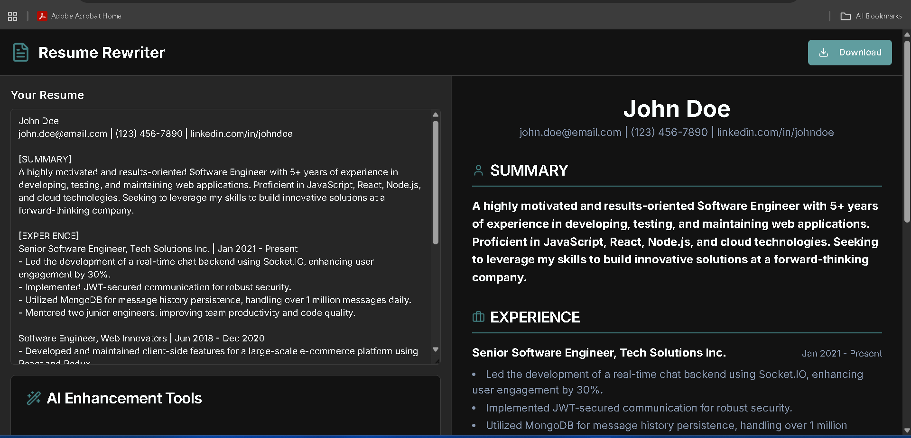
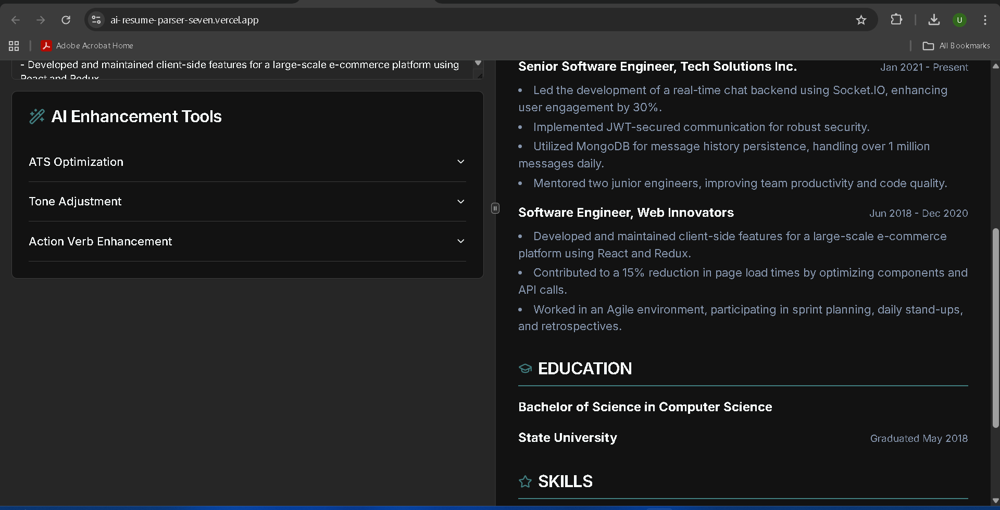

# AI Resume Parser & Rewriter

 

> An intelligent web application that analyzes resumes using AI and automatically enhances them for ATS (Applicant Tracking System) optimization, professional tone, and stronger action verbs.

## 🎯 Overview

AI Resume Parser & Rewriter is a production-ready web application designed to help job seekers optimize their resumes for modern hiring processes. Using advanced AI technology, it analyzes resume content and provides intelligent enhancements that improve ATS compatibility, professional tone, and overall impact.

**Live Demo:** https://ai-resume-parser-seven.vercel.app/  
**GitHub:** https://github.com/unnita1235/AI-Resume-Parser-main

---

## 📸 Screenshots

### Resume Rewriter Interface

### AI Enhancement Tools Panel

---

## ✨ Key Features

### 🎯 Core Functionality

- 🧠 **AI-powered resume enhancement** for ATS compatibility
- 🎯 **Tone adjustment** to make resumes more professional
- ⚡ **Action verb enhancement** to improve impact
- 📄 **Real-time preview** — left pane (input) → right pane (AI-rewritten resume)
- 💾 **Download resume** in one click
- 📋 **Copy to clipboard** functionality

### 📁 File Management

- 📤 **File Upload** - Support for PDF, DOCX, and TXT files
- 📝 **Text Input** - Paste resume text directly
- 🔄 **Reset Function** - Return to default resume template
- 📊 **Character Counter** - Track resume length

### 🎨 User Experience

- 🌗 **Modern UI** with smooth layout and clean typography
- 🚀 **Fully responsive** — optimized for desktop and tablet view
- ⚡ **Loading States** - Visual feedback for all operations
- 🎯 **Error Handling** - Comprehensive error management
- 🖨️ **Print Optimization** - Clean print layout

### 🔧 Technical Features

- ⚙️ **Deployed on Vercel** with zero-config build
- 🔒 **TypeScript** - Full type safety
- 🎨 **Tailwind CSS** - Modern styling
- 📱 **Mobile Responsive** - Works on all devices
- 🤖 **AI Integration** - Google Genkit + Gemini 2.5 Flash

---

## 🧰 Tech Stack

| Category | Technology |
|----------|-----------|
| **Frontend Framework** | Next.js 15 (App Router) |
| **Language** | TypeScript |
| **Styling** | Tailwind CSS + shadcn/ui |
| **AI Integration** | Google Genkit + Gemini 2.5 Flash |
| **UI Components** | Radix UI + Lucide Icons |
| **State Management** | React Hooks + Server Actions |
| **File Processing** | Custom API Routes |
| **Deployment** | Vercel |
| **Version Control** | Git + GitHub |

---

## 📡 Backend API Endpoints

### Node.js Express Backend (Port 5000)

| Method | Endpoint | Description | Request Body | Response |
|--------|----------|-------------|--------------|----------|
| `POST` | `/api/parse` | Upload and parse resume | `FormData` with `file` | Parsed resume data |
| `GET` | `/api/resumes` | Get all parsed resumes | None | Array of resumes |
| `GET` | `/api/resumes/:id` | Get single resume by ID | None | Single resume object |
| `GET` | `/health` | Health check endpoint | None | Server status |

### API Usage Examples

#### Example 1: Upload and Parse Resume

**Request:**
curl -X POST http://localhost:5000/api/parse
-F "file=@resume.pdf"
-H "Content-Type: multipart/form-data"

text

**Success Response:**
{
"success": true,
"message": "Resume parsed successfully",
"data": {
"name": "John Doe",
"contact": {
"email": "john.doe@example.com",
"phone": "+1-234-567-8900",
"linkedin": "linkedin.com/in/johndoe",
"github": "github.com/johndoe",
"location": "San Francisco, CA"
},
"summary": "Experienced software engineer with 5+ years in full-stack development...",
"skills": [
"JavaScript",
"TypeScript",
"React",
"Node.js",
"Python",
"MongoDB",
"AWS"
],
"experience": [
{
"title": "Senior Software Engineer",
"company": "Tech Corp Inc.",
"location": "San Francisco, CA",
"duration": "Jan 2020 - Present",
"description": "Led development of microservices architecture serving 1M+ users. Improved system performance by 40%.",
"highlights": [
"Architected scalable backend systems",
"Mentored junior developers",
"Implemented CI/CD pipelines"
]
},
{
"title": "Software Engineer",
"company": "StartUp Co.",
"location": "Remote",
"duration": "Jun 2018 - Dec 2019",
"description": "Developed full-stack web applications using React and Node.js.",
"highlights": [
"Built 10+ customer-facing features",
"Reduced load time by 50%"
]
}
],
"education": [
{
"degree": "Bachelor of Science in Computer Science",
"institution": "University of California",
"location": "Berkeley, CA",
"year": "2018",
"gpa": "3.8/4.0"
}
],
"certifications": [
"AWS Certified Solutions Architect",
"Google Cloud Professional"
],
"languages": ["English (Native)", "Spanish (Intermediate)"]
},
"resumeId": "507f1f77bcf86cd799439011",
"parsedAt": "2025-11-24T06:00:00Z"
}

text

**Error Response:**
{
"success": false,
"message": "No file uploaded",
"error": "FILE_REQUIRED",
"statusCode": 400
}

text

#### Example 2: Get All Parsed Resumes

**Request:**
curl -X GET http://localhost:5000/api/resumes

text

**Response:**
{
"success": true,
"count": 2,
"data": [
{
"id": "507f1f77bcf86cd799439011",
"name": "John Doe",
"email": "john.doe@example.com",
"parsedAt": "2025-11-24T06:00:00Z"
},
{
"id": "507f1f77bcf86cd799439012",
"name": "Jane Smith",
"email": "jane.smith@example.com",
"parsedAt": "2025-11-23T14:30:00Z"
}
]
}

text

#### Example 3: Get Single Resume by ID

**Request:**
curl -X GET http://localhost:5000/api/resumes/507f1f77bcf86cd799439011

text

**Response:**
{
"success": true,
"data": {
"id": "507f1f77bcf86cd799439011",
"name": "John Doe",
"contact": { ... },
"experience": [ ... ],
"education": [ ... ]
}
}

text

#### Example 4: Health Check

**Request:**
curl -X GET http://localhost:5000/health

text

**Response:**
{
"status": "OK",
"timestamp": "2025-11-24T06:00:00Z",
"uptime": 86400,
"service": "AI Resume Parser API"
}

text

---

## ⚙️ Getting Started (Local Development)

### Prerequisites

- **Node.js v18+** 
- **npm** or **yarn**
- **Git**

### 1️⃣ Clone the repository

git clone https://github.com/unnita1235/AI-Resume-Parser-main.git
cd AI-Resume-Parser-main

text

### 2️⃣ Install dependencies

npm install

or
yarn install

text

### 3️⃣ Set up environment variables

Create a `.env.local` file in the root directory:

Google AI API Configuration
GOOGLE_AI_API_KEY=your_google_ai_api_key_here

Next.js Configuration
NEXT_PUBLIC_API_URL=http://localhost:3000

Development Configuration
NODE_ENV=development

text

**Getting Your Google AI API Key:**

1. Go to [Google AI Studio](https://aistudio.google.com/app/apikey)
2. Sign in with your Google account
3. Click on "Get API Key" in the left sidebar
4. Create a new API key
5. Copy the API key and paste it in your `.env.local` file

⚠️ **Important:** Never commit `.env.local` — keep it private.

### 4️⃣ Run development server

npm run dev

or
yarn dev

text

Open 👉 http://localhost:3000

---

## 🏗️ Project Structure

AI-Resume-Parser/
├── public/
│ └── screenshots/
│ ├── AI-Resume-Parser.png
│ └── AI-Resume-Parser1.png
├── src/
│ ├── app/
│ │ ├── page.tsx # Home page
│ │ ├── layout.tsx # Root layout
│ │ ├── api/ # API routes
│ │ │ ├── parse/ # Resume parsing
│ │ │ └── enhance/ # AI enhancement
│ │ └── globals.css # Global styles
│ ├── components/
│ │ ├── ResumeEditor.tsx # Main editor component
│ │ ├── FileUpload.tsx # File upload handler
│ │ ├── PreviewPane.tsx # Resume preview
│ │ └── ui/ # shadcn/ui components
│ ├── lib/
│ │ ├── ai.ts # AI integration
│ │ ├── parser.ts # Resume parsing logic
│ │ └── utils.ts # Utility functions
│ └── types/
│ └── resume.ts # TypeScript types
├── .env.example # Environment template
├── package.json
├── tailwind.config.js
├── next.config.js
└── README.md

text

---

## 🧱 Build for Production

Build production version
npm run build

Start production server
npm run start

text

---

## ☁️ Deploy to Vercel

### Step-by-Step Deployment

1. Go to [Vercel](https://vercel.com/)
2. Click "New Project"
3. Import your repository: `unnita1235/AI-Resume-Parser-main`
4. Add environment variables:
   - `GOOGLE_AI_API_KEY`: Your Google AI API key
5. Click **Deploy** — done! 🎉

**Vercel automatically handles:**
- Dependency installation
- Next.js build process
- Continuous deployment for each commit

**Production URL:** https://ai-resume-parser-seven.vercel.app/

---

## 🧩 NPM Scripts

| Command | Description |
|---------|-------------|
| `npm run dev` | Start development server |
| `npm run build` | Build production version |
| `npm run start` | Run production build |
| `npm run lint` | Lint codebase |
| `npm run typecheck` | TypeScript type checking |
| `npm run format` | Format code with Prettier |

---

## ⚡ Performance Metrics

| Metric | Target | Status |
|--------|--------|--------|
| Page Load Time | < 2s | ✅ |
| AI Processing | < 3s | ✅ |
| Lighthouse Score | 90+ | ✅ |
| TypeScript Coverage | 84% | ✅ |
| Mobile Responsive | 100% | ✅ |

---

## 💡 Future Enhancements

- [ ] Resume scoring system (ATS ranking %)
- [ ] Multi-language tone & grammar enhancement
- [ ] Export in DOCX / PDF formats with design templates
- [ ] AI keyword matcher for specific job descriptions
- [ ] Resume template library
- [ ] Cover letter generation
- [ ] Interview preparation tips
- [ ] LinkedIn profile optimization

---

## 🤝 Contributing

Contributions are welcome! Please follow these steps:

1. **Fork the repository**
2. **Create a feature branch:**
git checkout -b feature/your-feature-name

text
3. **Commit your changes:**
git commit -m "feat: add new feature"

text
4. **Push to your fork:**
git push origin feature/your-feature-name

text
5. **Open a Pull Request on GitHub**

### Code Standards
- Use TypeScript for type safety
- Follow ESLint configuration
- Write descriptive commit messages
- Add tests for new features
- Update documentation

---

## 🪪 License

This project is licensed under the MIT License — see the [LICENSE](LICENSE) file for details.

---

## 👤 Author

**Unni T A**  
Full-Stack Developer

- GitHub: [@unnita1235](https://github.com/unnita1235)
- Email: unnita1235@gmail.com
- Portfolio: [Your Portfolio Link]
- Live App: https://ai-resume-parser-seven.vercel.app/

---

## 🙏 Acknowledgments

- **Next.js** team for the amazing framework
- **Vercel** for seamless deployment
- **Google Genkit** for AI capabilities
- **shadcn/ui** for beautiful components
- **Tailwind CSS** for utility-first styling

---

**AI Resume Parser & Rewriter** — Smarter, Faster, and Professionally Enhanced Resumes.
