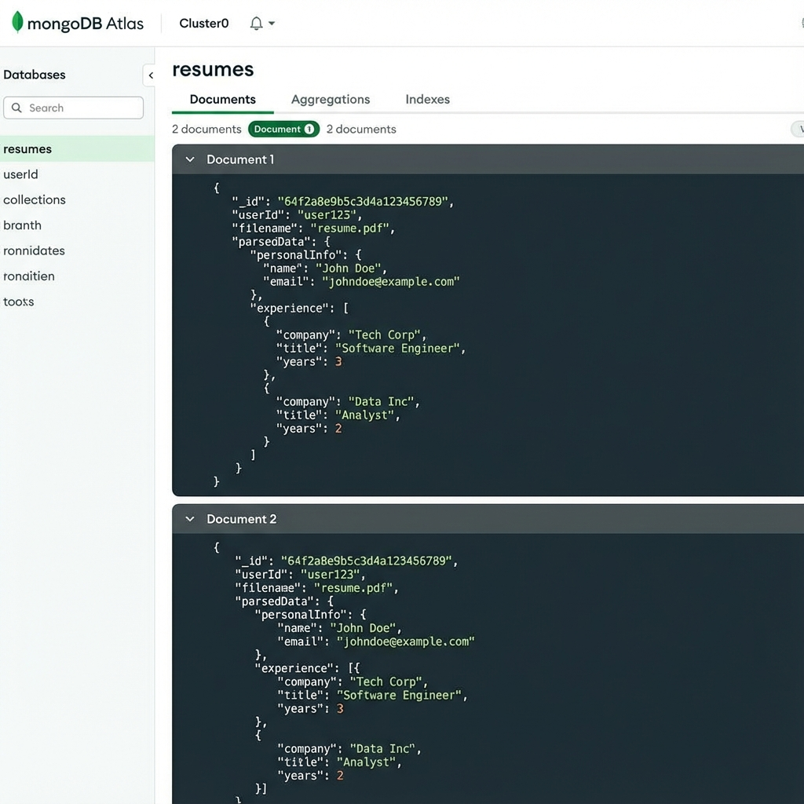

# 🚀 AI Resume Parser & Optimizer

[](https://ai-resume-parser-seven.vercel.app)
[](https://ai-resume-parser-0cmr.onrender.com/health)
[](LICENSE)
[](https://nextjs.org/)
[](https://www.typescriptlang.org/)

> **AI-powered resume optimization tool** that helps job seekers create ATS-friendly resumes with intelligent suggestions for formatting, tone, and content enhancement.

---

## ✨ Features

### 🎯 Core Functionality
- **📄 Resume Upload** - Support for PDF, DOCX, and TXT files (up to 5MB)
- **🤖 AI-Powered Analysis** - Google Gemini AI integration for intelligent parsing
- **📊 ATS Optimization** - Get scored on ATS compatibility with actionable recommendations
- **✍️ Tone Adjustment** - Switch between formal and casual writing styles
- **💪 Action Verb Enhancement** - Strengthen resume language with powerful verbs
- **📝 Cover Letter Generator** - Create personalized cover letters from your resume
- **📋 Real-time Preview** - Live preview with split-panel editing
- **📱 Responsive Design** - Works seamlessly on desktop, tablet, and mobile

### 🔧 Additional Features
- **Copy to Clipboard** - Quick copy for enhanced text
- **File Upload** - Drag-and-drop or click to upload
- **Demo Mode** - Test the app without API keys (sample data)
- **Backend Status Indicator** - Real-time connection monitoring
- **Dark Mode Support** - Automatic theme detection

---

## 🎬 Demo

**Live Application:** [https://ai-resume-parser-seven.vercel.app](https://ai-resume-parser-seven.vercel.app)

**Backend API:** [https://ai-resume-parser-0cmr.onrender.com/health](https://ai-resume-parser-0cmr.onrender.com/health)

### Screenshots



---

## 🏗️ Tech Stack

### Frontend
- **Framework:** Next.js 15.3.6 (App Router)
- **Language:** TypeScript 5.x
- **Styling:** Tailwind CSS 3.4
- **UI Components:** shadcn/ui + Radix UI
- **Forms:** React Hook Form + Zod validation
- **Icons:** Lucide React

### Backend
- **Runtime:** Node.js 18+
- **Framework:** Express.js 4.18
- **Database:** MongoDB Atlas (optional)
- **File Processing:** pdf-parse, mammoth
- **Testing:** Jest + Supertest

### AI Integration
- **Model:** Google Gemini 2.0 Flash
- **Framework:** Genkit AI
- **Features:**
  - ATS optimization analysis
  - Tone adjustment (formal/casual)
  - Action verb enhancement
  - Cover letter generation

### Deployment
- **Frontend:** Vercel (with automatic deployments)
- **Backend:** Render (free tier with auto-sleep)
- **Database:** MongoDB Atlas (free tier)

---

## 🚀 Quick Start

### Prerequisites

- Node.js 18.x or higher
- npm or yarn package manager
- Google Gemini API key ([Get one free](https://aistudio.google.com/app/api-keys))

### Installation

1. **Clone the repository**
   ```bash
   git clone https://github.com/unnita1235/AI-Resume-Parser.git
   cd AI-Resume-Parser
   ```

2. **Install frontend dependencies**
   ```bash
   npm install
   ```

3. **Install backend dependencies**
   ```bash
   cd backend
   npm install
   cd ..
   ```

4. **Configure environment variables**

   Create `.env.local` in the root directory:
   ```env
   # Frontend Environment Variables
   GOOGLE_GENAI_API_KEY=your_google_gemini_api_key_here
   NEXT_PUBLIC_API_URL=http://localhost:5000
   ```

   Create `.env` in the `backend/` directory:
   ```env
   # Backend Environment Variables
   PORT=5000
   GOOGLE_GEMINI_API_KEY=your_google_gemini_api_key_here
   MONGODB_URI=your_mongodb_connection_string (optional)
   DEMO_MODE=false
   MAX_FILE_SIZE=5242880
   UPLOAD_PATH=./uploads
   ```

5. **Start the development servers**

   Terminal 1 (Frontend):
   ```bash
   npm run dev
   ```

   Terminal 2 (Backend):
   ```bash
   cd backend
   npm run dev
   ```

6. **Open your browser**

   Navigate to [http://localhost:3000](http://localhost:3000)

---

## 📁 Project Structure

```
AI-Resume-Parser/
├── src/
│   ├── app/                      # Next.js App Router
│   │   ├── page.tsx             # Main resume editor page
│   │   ├── layout.tsx           # Root layout with metadata
│   │   ├── actions.ts           # Server actions for AI flows
│   │   ├── dashboard/           # Dashboard page (analytics)
│   │   ├── cover-letter/        # Cover letter generator
│   │   └── api/                 # API routes
│   │       ├── health/          # Health check endpoint
│   │       └── extract-text/    # File text extraction
│   ├── components/              # React components
│   │   ├── resume-editor.tsx   # Main editor component
│   │   ├── resume-preview.tsx  # Live preview component
│   │   ├── file-upload.tsx     # File upload component
│   │   ├── header.tsx          # App header
│   │   ├── BackendStatusBadge.tsx
│   │   ├── StatusIndicator.tsx
│   │   └── ui/                 # shadcn/ui components
│   ├── hooks/                   # Custom React hooks
│   │   ├── useBackendStatus.ts # Backend connection hook
│   │   ├── use-toast.ts        # Toast notifications
│   │   └── use-mobile.tsx      # Mobile detection
│   ├── lib/                     # Utility functions
│   │   ├── utils.ts            # General utilities
│   │   ├── constants.ts        # App constants
│   │   ├── resume-parser.ts    # Resume parsing logic
│   │   └── placeholder-images.ts
│   ├── ai/                      # AI/Genkit integration
│   │   ├── genkit.ts           # Genkit configuration
│   │   └── flows/              # AI flow definitions
│   │       ├── optimize-for-ats.ts
│   │       ├── tone-adjustment.ts
│   │       ├── action-verb-enhancement.ts
│   │       └── cover-letter-generation.ts
│   └── contexts/               # React contexts
│       └── BackendStatusContext.tsx
├── backend/                    # Express.js API server
│   ├── src/
│   │   ├── server.js          # Main server file
│   │   ├── keep-alive.js      # Auto-ping mechanism
│   │   └── utils/             # Backend utilities
│   │       └── resume-parser.js
│   ├── __tests__/             # Test files
│   │   ├── health.test.js
│   │   ├── parse.test.js
│   │   └── parseWithRegex.test.js
│   ├── jest.config.js         # Jest configuration
│   └── package.json           # Backend dependencies
├── public/                    # Static assets
│   ├── favicon.ico
│   └── screenshots/
├── docs/                      # Documentation
├── .env.local                 # Frontend environment (gitignored)
├── .env.example              # Environment template
├── next.config.ts            # Next.js configuration
├── tailwind.config.ts        # Tailwind configuration
├── tsconfig.json             # TypeScript configuration
├── package.json              # Frontend dependencies
├── DEPLOYMENT.md             # Deployment guide
├── ARCHITECTURE.md           # System architecture
├── FRONTEND_FIXES.md         # Recent fixes documentation
└── README.md                 # This file
```

---

## 🎯 How It Works

### 1. **Upload or Paste Resume**
   - Upload PDF, DOCX, or TXT files
   - Or paste resume text directly into the editor

### 2. **Extract Text**
   - Frontend sends file to `/api/extract-text`
   - pdf-parse extracts text from PDFs
   - mammoth extracts text from DOCX files
   - TXT files are read directly

### 3. **AI Analysis** (Optional - requires API key)
   - Text is sent to Google Gemini API
   - Four AI flows process the content:
     - **ATS Optimization**: Analyzes ATS compatibility, suggests keywords
     - **Tone Adjustment**: Adjusts writing style (formal/casual)
     - **Action Verbs**: Enhances power words and strong verbs
     - **Cover Letter**: Generates personalized cover letters

### 4. **Real-time Preview**
   - Split-panel interface shows live changes
   - Copy enhanced text to clipboard
   - Manual editing supported

### 5. **Demo Mode Fallback**
   - If backend is unavailable, demo data is shown
   - Sample parsed resumes displayed
   - All features work with mock data

---

## 🔌 API Endpoints

### Frontend API Routes

#### `GET /api/health`
Health check endpoint for frontend API
```json
{
  "status": "healthy",
  "timestamp": "2026-01-06T10:00:00.000Z",
  "services": {
    "api": "operational",
    "fileProcessing": "operational",
    "ai": "operational"
  }
}
```

#### `POST /api/extract-text`
Extract text from uploaded resume files
```typescript
// Request
FormData {
  file: File (PDF, DOCX, or TXT)
}

// Response
{
  "success": true,
  "text": "Extracted resume text...",
  "metadata": {
    "fileName": "resume.pdf",
    "fileSize": 125000,
    "characterCount": 2500,
    "wordCount": 450
  }
}
```

### Backend API Endpoints

#### `GET /health`
Backend server health check
```json
{
  "status": "healthy",
  "uptime": 3600,
  "mode": "production",
  "database": "connected",
  "version": "2.0.0"
}
```

#### `POST /api/parse`
Parse resume file (requires file upload)
```typescript
// Request (multipart/form-data)
{
  file: File
}

// Response
{
  "success": true,
  "data": {
    "name": "John Doe",
    "email": "john@example.com",
    "phone": "+1-555-0123",
    "linkedin": "linkedin.com/in/johndoe",
    "github": "github.com/johndoe",
    "skills": ["React", "Node.js", "Python"],
    "experience": [],
    "education": [],
    "summary": "..."
  },
  "parseMethod": "ai",
  "accuracy": 92
}
```

#### `GET /api/resumes`
Get list of parsed resumes (requires MongoDB)
```json
{
  "success": true,
  "count": 10,
  "total": 50,
  "data": [...]
}
```

#### `GET /api/demo-resumes`
Get sample/demo resumes (no auth required)
```json
{
  "success": true,
  "mode": "demo",
  "data": [
    {
      "name": "John Anderson",
      "email": "john.anderson@email.com",
      "skills": ["React", "Node.js", "Python"],
      "accuracy": 92
    }
  ]
}
```

---

## 🧪 Testing

### Run All Tests
```bash
# Backend tests
cd backend
npm test

# With coverage
npm run test:coverage
```

### Test Results
- **56 tests passing** for `parseWithRegex` function
- **100% coverage** on regex parser utilities
- Health check endpoint tests ✅
- API stats endpoint tests ✅
- Demo data endpoint tests ✅

---

## 🌐 Deployment

### Deploy to Vercel (Frontend)

1. **Connect GitHub repository**
   - Visit [Vercel Dashboard](https://vercel.com/new)
   - Import your GitHub repository

2. **Configure environment variables**
   ```env
   GOOGLE_GENAI_API_KEY=your_api_key
   NEXT_PUBLIC_API_URL=your_backend_url
   ```

3. **Deploy**
   - Vercel auto-deploys on every push to `main`

### Deploy to Render (Backend)

1. **Create new Web Service**
   - Visit [Render Dashboard](https://dashboard.render.com/)
   - Select "New Web Service"

2. **Configure build settings**
   ```yaml
   Build Command: cd backend && npm install
   Start Command: cd backend && npm start
   ```

3. **Add environment variables**
   ```env
   GOOGLE_GEMINI_API_KEY=your_api_key
   MONGODB_URI=your_mongo_uri (optional)
   PORT=5000
   ```

See [DEPLOYMENT.md](DEPLOYMENT.md) for detailed instructions.

---

## ⚙️ Available Scripts

### Frontend
```bash
npm run dev          # Start development server (port 3000)
npm run build        # Build for production
npm run start        # Start production server
npm run lint         # Run ESLint
npm run lint:fix     # Fix ESLint errors
npm run typecheck    # TypeScript type checking
npm run format       # Format code with Prettier
npm run clean        # Remove build artifacts
```

### Backend
```bash
cd backend
npm run dev          # Start development server (port 5000)
npm start            # Start production server
npm test             # Run Jest tests
npm run test:watch   # Run tests in watch mode
npm run test:coverage # Generate coverage report
```

---

## 🔐 Environment Variables

### Frontend (`.env.local`)

| Variable | Required | Description | Default |
|----------|----------|-------------|---------|
| `GOOGLE_GENAI_API_KEY` | Yes | Google Gemini API key | - |
| `NEXT_PUBLIC_API_URL` | No | Backend API URL | Auto-detected |

### Backend (`backend/.env`)

| Variable | Required | Description | Default |
|----------|----------|-------------|---------|
| `GOOGLE_GEMINI_API_KEY` | Yes | Google Gemini API key | - |
| `MONGODB_URI` | No | MongoDB connection string | - |
| `PORT` | No | Server port | 5000 |
| `DEMO_MODE` | No | Enable demo mode | false |
| `MAX_FILE_SIZE` | No | Max upload size (bytes) | 5242880 (5MB) |
| `UPLOAD_PATH` | No | Upload directory | ./uploads |

---

## 🎨 AI Flows

### 1. ATS Optimization (`optimize-for-ats.ts`)
Analyzes resume for Applicant Tracking System compatibility
- **Input**: Resume text, job description (optional)
- **Output**: ATS score, missing keywords, recommendations

### 2. Tone Adjustment (`tone-adjustment.ts`)
Adjusts writing style to formal or casual
- **Input**: Resume text, desired tone
- **Output**: Rewritten text in target tone

### 3. Action Verb Enhancement (`action-verb-enhancement.ts`)
Strengthens language with powerful action verbs
- **Input**: Bullet point or sentence
- **Output**: Enhanced versions with strong verbs

### 4. Cover Letter Generation (`cover-letter-generation.ts`)
Creates personalized cover letters
- **Input**: Resume, job description, company info, tone
- **Output**: Cover letter, key highlights, email subject

---

## 📊 Features Status

| Feature | Status | Description |
|---------|--------|-------------|
| Resume Upload | ✅ Live | PDF, DOCX, TXT support (up to 5MB) |
| Text Extraction | ✅ Live | pdf-parse & mammoth integration |
| AI Parsing | ✅ Live | Google Gemini 2.0 Flash |
| ATS Optimization | ✅ Live | Score + recommendations |
| Tone Adjustment | ✅ Live | Formal ↔ Casual |
| Action Verbs | ✅ Live | Power word suggestions |
| Cover Letters | ✅ Live | AI-generated letters |
| Live Preview | ✅ Live | Split-panel editor |
| Copy to Clipboard | ✅ Live | One-click copy |
| Demo Mode | ✅ Live | Works without backend |
| Dashboard | ✅ Live | Analytics page (mock data) |
| Mobile Responsive | ✅ Live | Works on all devices |
| Dark Mode | ✅ Live | Auto theme detection |
| User Accounts | ⏳ Planned | Authentication system |
| Resume History | ⏳ Planned | Save/load resumes |
| PDF Export | ⏳ Planned | Download formatted resume |
| Job Matching | ⏳ Planned | Match to job descriptions |

---

## ⚠️ Known Limitations

### Backend Sleep Issue (Render Free Tier)
- **Problem**: Backend sleeps after 15 minutes of inactivity
- **Impact**: First request may take 30-50 seconds to wake up
- **Solution**: Upgrade to paid plan ($7/month) or implement keep-alive

### No Persistent Storage
- **Problem**: No user accounts or database (MongoDB optional)
- **Impact**: Resumes not saved, history lost on refresh
- **Solution**: Add authentication and enable MongoDB

### File Size Limit
- **Limit**: 5MB per file
- **Reason**: Prevent memory issues on free hosting
- **Workaround**: Compress files or use text input

### API Rate Limits
- **Google Gemini**: 60 requests/minute (free tier)
- **Solution**: Add rate limiting and queuing

---

## 🐛 Troubleshooting

### Build Errors

**TypeScript errors:**
```bash
npm run typecheck
```
Fix any type errors before building.

**Module not found:**
```bash
rm -rf node_modules package-lock.json
npm install
```

### Runtime Errors

**Backend not responding:**
1. Check backend is running: `curl http://localhost:5000/health`
2. Verify environment variables are set
3. Check Render logs if deployed

**AI features not working:**
1. Verify `GOOGLE_GENAI_API_KEY` is set correctly
2. Check API quota at [Google AI Studio](https://aistudio.google.com/app/api-keys)
3. Enable demo mode as fallback

**File upload fails:**
1. Check file size (<5MB)
2. Verify file type (PDF, DOCX, TXT only)
3. Check backend `/api/parse` endpoint is accessible

---

## 🤝 Contributing

Contributions are welcome! Please follow these steps:

1. **Fork the repository**
2. **Create a feature branch**
   ```bash
   git checkout -b feature/your-feature-name
   ```
3. **Make your changes**
   - Follow existing code style
   - Add tests for new features
   - Update documentation
4. **Commit your changes**
   ```bash
   git commit -m "feat: add your feature description"
   ```
5. **Push to your fork**
   ```bash
   git push origin feature/your-feature-name
   ```
6. **Open a Pull Request**

### Code Style
- **TypeScript** for all new code
- **ESLint** configuration must pass
- **Prettier** for code formatting
- **Conventional Commits** for commit messages

---

## 📄 License

This project is licensed under the MIT License - see the [LICENSE](LICENSE) file for details.

---

## 👤 Author

**Unni T A**
Full Stack Developer | AI Enthusiast

- 🐙 GitHub: [@unnita1235](https://github.com/unnita1235)
- 📧 Email: unnita1235@gmail.com
- 💼 Portfolio: [github.com/unnita1235](https://github.com/unnita1235)

---

## 🙏 Acknowledgments

- **Google Gemini Team** - For the powerful AI model
- **Next.js Team** - For the excellent framework
- **Vercel** - For seamless deployment
- **shadcn** - For beautiful UI components
- **Radix UI** - For accessible component primitives
- **Open Source Community** - For amazing tools and libraries

---

## 📚 Documentation

- [Deployment Guide](DEPLOYMENT.md) - Detailed deployment instructions
- [Architecture Overview](ARCHITECTURE.md) - System design and architecture
- [Frontend Fixes](FRONTEND_FIXES.md) - Recent bug fixes and improvements
- [API Documentation](docs/) - Complete API reference

---

## 🗺️ Roadmap

### Q1 2026
- [ ] Add user authentication (Firebase/Auth0)
- [ ] Implement resume history with MongoDB
- [ ] Add PDF export functionality
- [ ] Improve ATS scoring algorithm

### Q2 2026
- [ ] Job description matching feature
- [ ] Resume templates library
- [ ] Batch processing for multiple resumes
- [ ] Analytics dashboard with real data

### Q3 2026
- [ ] LinkedIn profile import
- [ ] Resume comparison tool
- [ ] Mobile app (React Native)
- [ ] Premium features and monetization

---

## 📞 Support

- **Bug Reports**: [Open an issue](https://github.com/unnita1235/AI-Resume-Parser/issues)
- **Feature Requests**: [Open an issue](https://github.com/unnita1235/AI-Resume-Parser/issues)
- **Questions**: Check [DEPLOYMENT.md](DEPLOYMENT.md) or open a discussion

---

## ⭐ Show Your Support

If you find this project helpful, please consider:
- ⭐ Starring the repository
- 🐛 Reporting bugs
- 💡 Suggesting new features
- 🔀 Contributing code
- 📢 Sharing with others

---

<div align="center">

**Built with ❤️ using Next.js, TypeScript, and Google Gemini AI**

[Live Demo](https://ai-resume-parser-seven.vercel.app) • [Report Bug](https://github.com/unnita1235/AI-Resume-Parser/issues) • [Request Feature](https://github.com/unnita1235/AI-Resume-Parser/issues)

</div>
