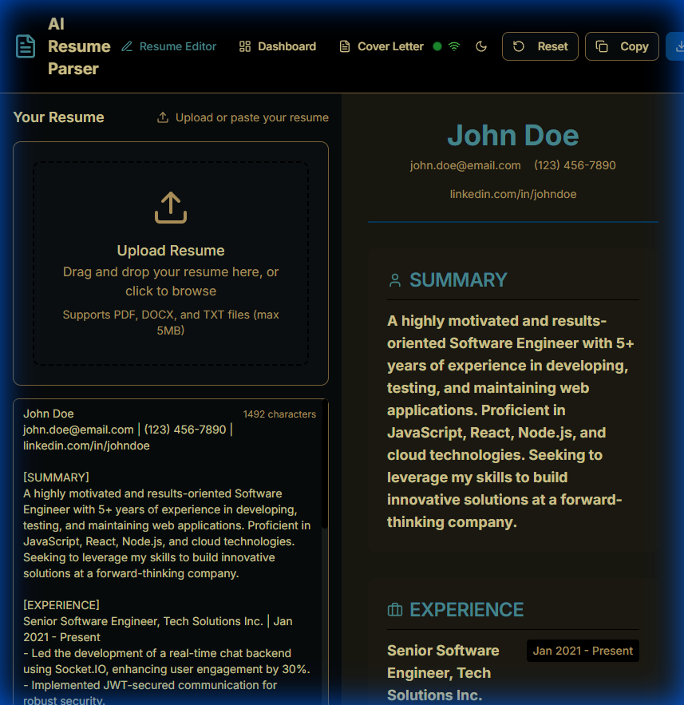

<div align="center">

# 🚀 AI Resume Parser & Optimizer

### Transform Your Resume with AI-Powered Intelligence

[](https://nextjs.org/)
[](https://www.typescriptlang.org/)
[](https://nodejs.org/)
[](LICENSE)

<p align="center">
  <strong>AI-powered resume optimization tool that helps job seekers create ATS-friendly resumes</strong><br>
  <em>Intelligent suggestions for formatting, tone adjustment, and content enhancement using Google Gemini AI</em>
</p>

[Features](#-features) •
[Quick Start](#-quick-start) •
[Installation](#-installation) •
[API Reference](#-api-reference) •
[Deployment](#-deployment)

---

## 📸 Screenshot

<p align="center">
  
</p>

<p align="center">
  <em>Split-panel interface with resume editor and live AI-powered preview</em>
</p>

</div>

---

## ✨ Features

<table>
<tr>
<td width="50%">

### 📄 Smart Resume Processing
- **Multi-format Support** — PDF, DOCX, TXT (up to 10MB)
- **AI-Powered Parsing** — Google Gemini 2.0 Flash integration
- **Fallback Processing** — Regex parser when AI unavailable

</td>
<td width="50%">

### 🎯 ATS Optimization
- **Compatibility Scoring** — Actionable improvement recommendations
- **Keyword Analysis** — Identify missing industry keywords
- **Format Optimization** — ATS-friendly structure suggestions

</td>
</tr>
<tr>
<td width="50%">

### ✍️ Content Enhancement
- **Tone Adjustment** — Switch between formal/casual styles
- **Action Verb Boost** — Strengthen language with power words
- **Cover Letter Generation** — Create personalized letters

</td>
<td width="50%">

### 💻 Modern Interface
- **Split-Panel Editor** — Real-time preview while editing
- **Responsive Design** — Works on desktop, tablet, mobile
- **Dark Mode** — Automatic theme detection

</td>
</tr>
</table>

---

## 🏗️ Tech Stack

| Layer | Technologies |
|-------|-------------|
| **Frontend** | Next.js 15.3, TypeScript, Tailwind CSS, shadcn/ui, Radix UI |
| **Backend** | Node.js 18+, Express.js 4.18, MongoDB (optional) |
| **AI** | Google Gemini 2.0 Flash via Genkit AI |
| **File Processing** | pdf-parse, mammoth |
| **Forms** | React Hook Form, Zod validation |
| **Testing** | Jest, Supertest |

---

## 🚀 Quick Start

### Prerequisites

- **Node.js 18+** — [Download](https://nodejs.org/)
- **Google Gemini API Key** — [Get free key](https://aistudio.google.com/app/api-keys)
- **MongoDB** (optional) — [MongoDB Atlas](https://cloud.mongodb.com)

### Installation

```bash
# Clone the repository
git clone https://github.com/unnita1235/AI-Resume-Parser.git
cd AI-Resume-Parser

# Install frontend dependencies
npm install

# Install backend dependencies
cd backend && npm install && cd ..
```

### Configuration

```bash
# Frontend environment
cp .env.example .env.local

# Backend environment
cp backend/.env.example backend/.env
```

**Edit `.env.local`:**
```env
GOOGLE_GENAI_API_KEY=your_api_key_here
NEXT_PUBLIC_API_URL=http://localhost:5000
```

**Edit `backend/.env`:**
```env
PORT=5000
GOOGLE_GEMINI_API_KEY=your_api_key_here
MONGODB_URI=your_mongodb_connection_string  # Optional
```

### Run Development Servers

```bash
# Terminal 1 — Frontend (port 3000)
npm run dev

# Terminal 2 — Backend (port 5000)
cd backend && npm run dev
```

Open [http://localhost:3000](http://localhost:3000) in your browser.

---

## 📁 Project Structure

```
AI-Resume-Parser/
├── src/
│   ├── app/                    # Next.js App Router
│   │   ├── page.tsx           # Main resume editor
│   │   ├── dashboard/         # Analytics dashboard
│   │   ├── cover-letter/      # Cover letter generator
│   │   └── api/               # API routes
│   ├── components/             # React components
│   │   ├── resume-editor.tsx  # Editor component
│   │   ├── resume-preview.tsx # Preview component
│   │   └── ui/                # shadcn/ui components
│   ├── ai/                     # Genkit AI integration
│   │   └── flows/             # AI flow definitions
│   ├── hooks/                  # Custom React hooks
│   └── lib/                    # Utility functions
│
├── backend/                    # Express.js API
│   ├── src/
│   │   ├── server.js          # Main server
│   │   ├── keep-alive.js      # Free-tier keep-alive
│   │   └── utils/
│   │       └── file-cleanup.js # Auto file cleanup
│   └── __tests__/             # Jest tests
│
├── .env.example                # Frontend env template
├── backend/.env.example        # Backend env template
└── README.md                   # This file
```

---

## 🔌 API Reference

### Health Check

```http
GET /health
```

**Response:**
```json
{
  "status": "healthy",
  "uptime": 3600,
  "mode": "production",
  "database": "connected",
  "version": "2.0.0"
}
```

### Parse Resume

```http
POST /api/parse
Content-Type: multipart/form-data
```

| Parameter | Type | Description |
|-----------|------|-------------|
| `file` | File | Resume file (PDF, DOCX, DOC) |

**Response:**
```json
{
  "success": true,
  "data": {
    "name": "John Doe",
    "email": "john@example.com",
    "phone": "+1-555-0123",
    "skills": ["React", "Node.js", "Python"],
    "experience": [...],
    "education": [...],
    "accuracy": 92,
    "parseMethod": "ai"
  }
}
```

### Additional Endpoints

| Endpoint | Method | Description |
|----------|--------|-------------|
| `/api/resumes` | GET | List all parsed resumes |
| `/api/resumes/:id` | GET | Get specific resume |
| `/api/demo-resumes` | GET | Sample demo data |
| `/api/stats` | GET | Server statistics |

---

## 🌐 Deployment

### Frontend → Vercel

1. Push to GitHub
2. Import project in [Vercel](https://vercel.com/new)
3. Add environment variables
4. Deploy

### Backend → Render

1. Create [Web Service](https://dashboard.render.com/)
2. Connect GitHub repository
3. Configure:
   - **Build:** `cd backend && npm install`
   - **Start:** `cd backend && npm start`
4. Add environment variables
5. Deploy

> 📖 See [DEPLOYMENT.md](DEPLOYMENT.md) for detailed instructions.

---

## ⚙️ Environment Variables

### Frontend

| Variable | Required | Description |
|----------|:--------:|-------------|
| `GOOGLE_GENAI_API_KEY` | ✅ | Google Gemini API key |
| `NEXT_PUBLIC_API_URL` | ❌ | Backend URL (auto-detected) |

### Backend

| Variable | Required | Description |
|----------|:--------:|-------------|
| `GOOGLE_GEMINI_API_KEY` | ✅ | Google Gemini API key |
| `MONGODB_URI` | ❌ | MongoDB connection string |
| `PORT` | ❌ | Server port (default: 5000) |
| `CORS_WHITELIST` | ❌ | Allowed origins (comma-separated) |
| `MAX_FILE_SIZE` | ❌ | Max upload size (default: 10MB) |
| `DEMO_MODE` | ❌ | Enable demo mode (default: false) |

---

## ⚠️ Known Limitations

| Issue | Impact | Workaround |
|-------|--------|------------|
| **Free-tier cold starts** | 30-50s delay after 15min inactivity | Upgrade to paid Render ($7/mo) |
| **No MongoDB = No persistence** | Data lost on refresh | Set up MongoDB Atlas (free) |
| **Gemini rate limits** | 60 requests/minute | Implement queuing for high traffic |
| **No authentication** | Open API access | Add auth for production |

---

## 🧪 Testing

```bash
# Run backend tests
cd backend
npm test

# Test coverage
npm run test:coverage

# TypeScript check
npm run typecheck  # from root
```

---

## 🤝 Contributing

1. Fork the repository
2. Create feature branch (`git checkout -b feature/amazing-feature`)
3. Commit changes (`git commit -m 'feat: add amazing feature'`)
4. Push to branch (`git push origin feature/amazing-feature`)
5. Open Pull Request

### Guidelines

- Use **TypeScript** for all new code
- Follow **Conventional Commits** format
- Run `npm run lint` before committing
- Add tests for new features

---

## 📄 License

This project is licensed under the **MIT License** — see [LICENSE](LICENSE) for details.

---

## 👤 Author

**Unni T A** — Full Stack Developer

[](https://github.com/unnita1235)
[](mailto:unnita1235@gmail.com)

---

## 🙏 Acknowledgments

- **Google Gemini Team** — AI model
- **Vercel** — Frontend hosting
- **shadcn** — UI components
- **Radix UI** — Accessible primitives

---

<div align="center">

**Built with ❤️ using Next.js, TypeScript, and Google Gemini AI**

⭐ Star this repo if you find it helpful!

</div>
